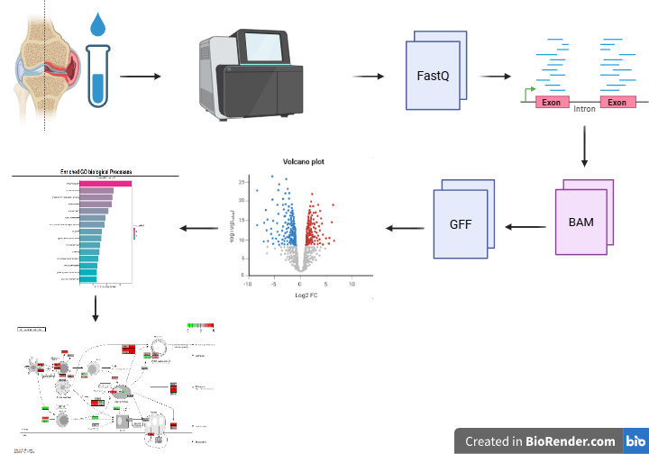
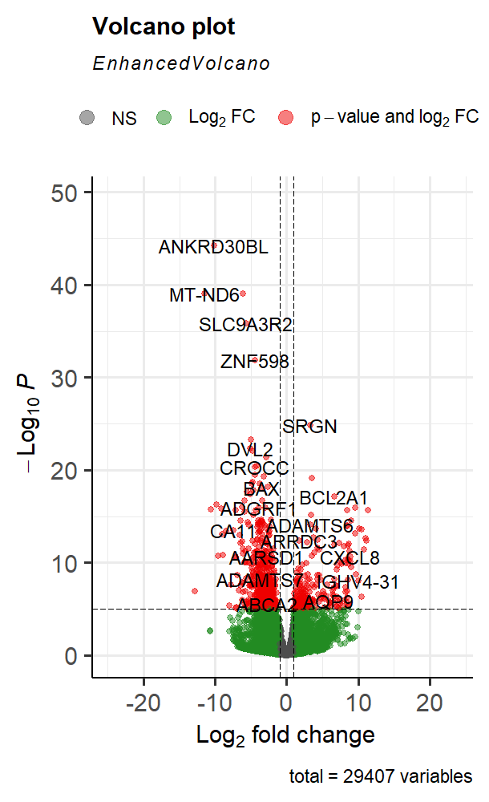
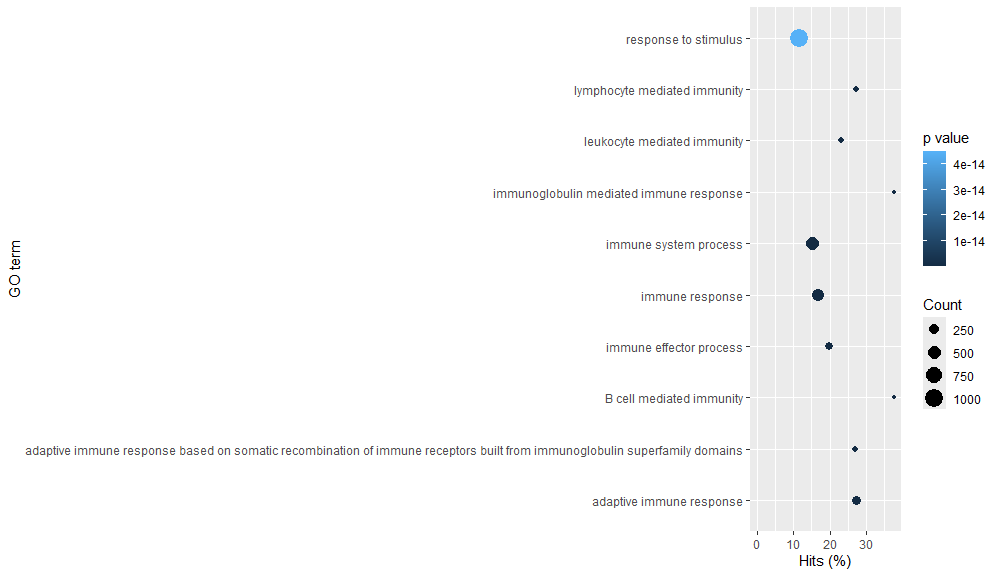
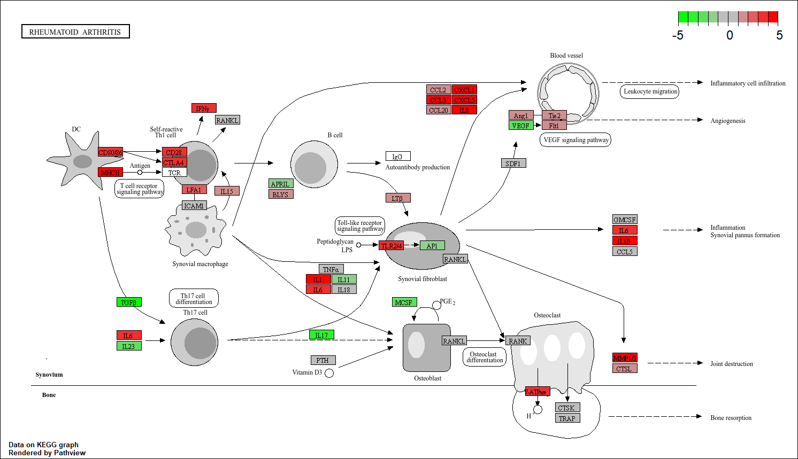
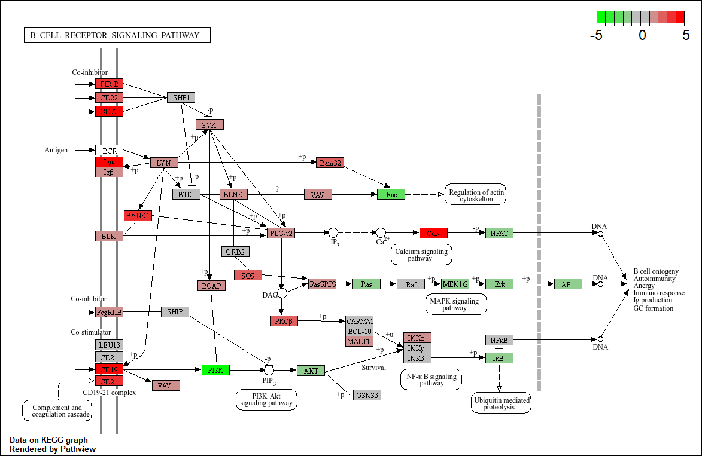

# Casus-Transcriptomics-reuma
# Inleiding
Reumatoïde Artritis (RA) is een chronische auto-immuunziekte geassocieerd met een onstekingsproces dat zowel de gewrichten als organen kan aantasten. De ontsteking komt het meest voor in de kleine gewrichten van handen en voeten, de gewrichten zijn dan vaak stijf, gezwollen en vaak doen ze pijn. RA kan niet worden genezen en de ziekte is progressief (Grassi et al., 1998). 
De oorzaak van RA is nog niet helemaal bekend en er is niet veel onderzoek over gedaan, dit komt doordat er gedacht wordt dat RA verschillende oorzaken heeft zoals door: omgeving, genetische en hormonale factoren (Tobón et al., 2010).
Doordat er gedacht wordt dat de oorzaak van RA door verschillende factoren kan komen zijn er ook verschillen de behandelingen voor patiënten met RA. Veel patiënten krijgen fysio therapie met verschillende soorten pijnstillers en reumaremmers, dit kan helpen met de pijn in de gewrichten en de progressie van de ziekte te vertragen (Majithia & Geraci, 2007). 
In dit onderzoek wordt er gekeken met behulp van transcriptomics naar welke genen in het gewrichtsslijmvlies meer of minder tot expressie komen in personen met RA en gezonde mensen.

# Methoden 
Om te bepalen of er verschillen zijn in genexpressie in het gewrichtsslijmvlies van gezonde mensen en mensen met Reumatoïde Artritis (RA) worden er gewrichtsslijmvliezen van 8 personen onderzocht. 4 van deze mensen hebben RA en 4 zijn controle personen. Deze personen zijn allemaal vrouw en hebben de leeftijd van 15 tot en met 66 jaar. Het analyseren van de data wordt uitgewerkt in R met de volgende packages: BiocManager (1.30.26) (Bioconductor - Install, n.d.), Rsubread (2.20,0) (Liao et al., 2019), Rsamtools (2.22.0) (Bioconductor - Rsamtools, n.d.), dplyr (1.1.4) (A Grammar of Data Manipulation • Dplyr, n.d.), readr (2.1.5) (Readr Package - RDocumentation, n.d.), DESeq2 (1.46.0) (Love et al., 2014), KEGGREST (1.46.0) (Bioconductor - KEGGREST, n.d.) en pathview (1.46.0) (Luo & Brouwer, 2013).

Rsubread wordt gebruikt voor het mappen van de reads. Voor het mappen van de reads is het humane genoom (GRCh38.P14) gebruikt als referentiegenoom, deze was van de NCBI website gedownload (Homo Sapiens Genome Assembly GRCh38.P14 - NCBI - NLM, n.d.). Waarna het genoom geïndexeerd en aligned wordt [zie script voor het mappen](https://github.com/Richt01/main/tree/Casus-Transcriptomics-reuma/R_scripts/script_voor_mappen.R).
featureCounts() uit de Rsubread package wordt gebruikt om een tabel te maken waarin staat hoeveel reads er gemapt zijn per gen (countmatrix). Hiervoor is het genomic.gtf bestand van de NCBI website gedownload (GCF_000001405.40) (Homo Sapiens Genome Assembly GRCh38.P14 - NCBI - NLM, n.d.). (bekijk script).
Met DESeq2 worden statistisch significante genen geanalyseerd die differentiaal tot expressie komen en gevisualiseerd met een volcano plot. (bekijk script).

Om te bepalen welke biologische processen betrokken zijn bij een veranderde genexpressie wordt er een GO-analyse uitgevoerd met goseq() en GO.dp. (Bekijk GO-analyse script). Met deze resultaten kan er met pathview de bijbehorende pathways bekeken worden van genen met een fold change van <-2 en >2 en een P-waarde van <0.05. (bekijk script van de KEGG-analyse). In figuur 1 is het flowschema weergegeven.
 
<a id="Fig1">Figuur1:</a> 
*flowschema van analyse data uit gewrichtsslijmvlies van 8 vrouwen 4 met RA en 4 controle personen. leeftijd is van 15 tot en met 66 jaar.  

#Resultaten 
Om verschil in expressie van genen te bepalen bij mensen met RA en personen zonder is er van 8 vrouwen gewrichtsslijmvlies onderzocht (4 met RA en 4 als controle personen). Deze data was gemapt en gecount in R en gevisualiseerd met een volcano plot. De statistisch significante genen (P < 0.05) met een fold change van < -2 en > 2 werden berekent met een GO-analyse waarmee een KEGG-analyse werd uitgevoerd met de relevante pathways.

In figuur 2 is de volcano plot weergegeven waar er 4572 statistisch significante genen zijn gevonden die meer/minder tot expressie komen bij RA patiënten ten opzichte van gezonde personen (p < 0.05 en een fold change van < -1 en > 1). Het gen met de laagste p waarde en hoogste fold change is het gen ANKRD30bl, de genen die erna volgen zijn: MT-ND6, SLC9A3R2 en ZNF598. Deze genen worden statistisch significant minder afgeschreven bij mensen met reuma ten opzichte van gezonde personen.
 
<a id="Fig1">Figuur2:</a>
*Figuur 2: volcano plot van alle genen met een p waarde van < 0.05 en een fold change van < -1 en > 1. Waar de niet statistisch significante genen grijs, log2FC groen en de -log2p-value in het rood zijn weergegeven.

In figuur 3 zijn de top 10 Enriched GO-termen weergeven (P < 0,05 en een fold change van < -2 en > 2). Uit de GO-analyse is gebleken dat uit de top 10 Enriched GO-termen de meeste biologische processen te maken hebben met het immuunsysteem. Met de nadruk op B-cellen, lymfocyten en antilichamen.
  
<a id="Fig1">Figuur3:</a>
*Figuur 3: De top 10 Enriched GO-termen met een statistisch significantie van P < 0,05 en een fold change van < -2 en > 2.

In figuur 4 is er naar de algemene RA KEGG-pathway gekeken waar P < 0,05 is en de is fold change van < -5 en > 5. De genen die verhoogt tot expressie komen zijn in het rood en verlaagd in het groen weergegeven. In deze pathway is er een verhoogde T-cel activatie, chemocines, cytokineproductie, osteoclastactivatie en botafbraak te zien (Malemud, 2018). 
 
<a id="Fig1">Figuur4:</a>
*Figuur 4: De algemene KEGG-pathway van RA (P < 0,05 is en de is fold change van < -5 en > 5).

In figuur 5 is de synthese van B-cellen weergeven met een KEGG-pathway waar P < 0,05 is en de is fold change van < -5 en > 5. Hier wordt er gezien dat de B-celreceptorroute eerst geactiveerd wordt, maar in de downstream is een remming weergeven. 
 
<a id="Fig1">Figuur5:</a>

#Conclusie

